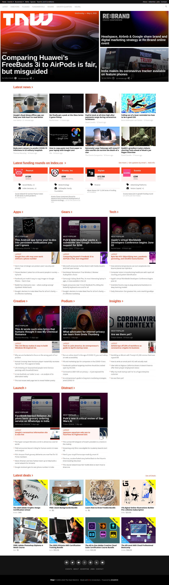

# Building with Responsive Design -- Thenextweb clone (Twn) 

> This project, consists of building a responsive website. By be cloning The Next Web, a tech-focused magazine which uses media queries to gracefully degrade their site as the window size is reduced.

Additional description about the project and its features.

## Built With

- HTML,
- CSS

## Live Demo

[Open Live Demo](https://rawcdn.githack.com/keddo/thenextweb-clone/cb582e4787a0fb76aeebfd3a564ebf607ffb51ee/index.html)

## Getting Started

**Clone the project to you local machine run index file**

### Setup
> Clone the project into you directory and open it.

## Authors

👤 **Kedir**

- Github: [@keddo](https://github.com/keddo)
- Twitter: [@kedirman](https://twitter.com/kedirman)
## 🤝 Contributing

Contributions, issues and feature requests are welcome!

Feel free to check the [issues page](issues/).

## Show your support

Give a ⭐️ if you like this project!

## Acknowledgments

- Hat tip to anyone whose code was used
- Inspiration
- etc

## 📝 License

This project is [MIT](lic.url) licensed.